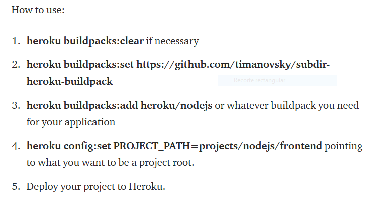
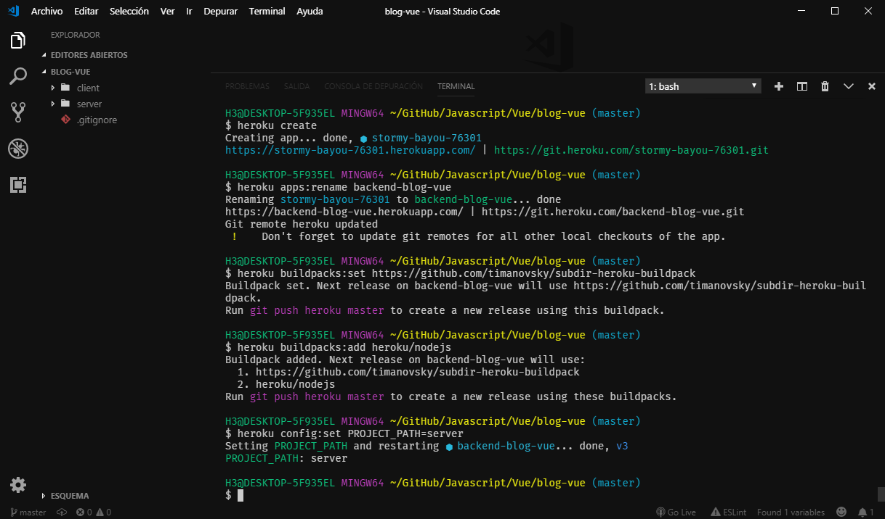
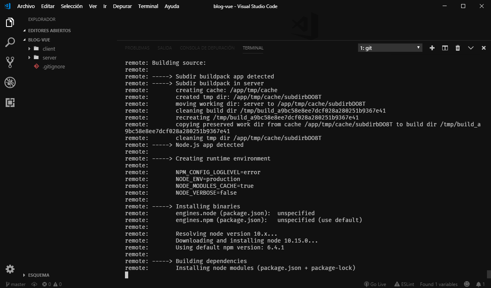
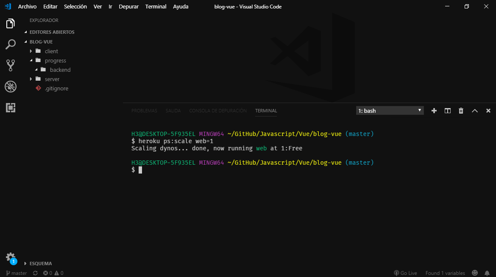
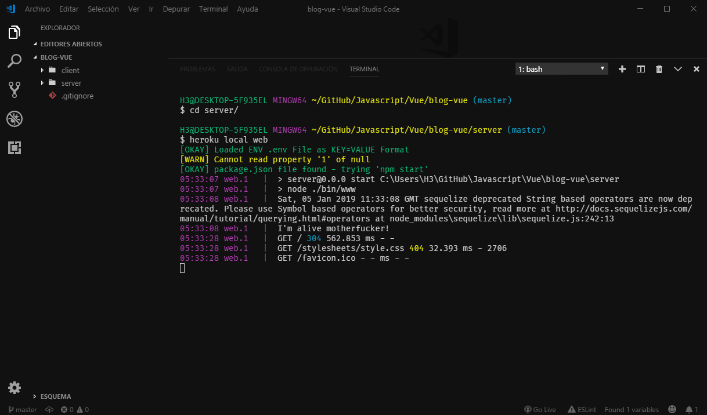
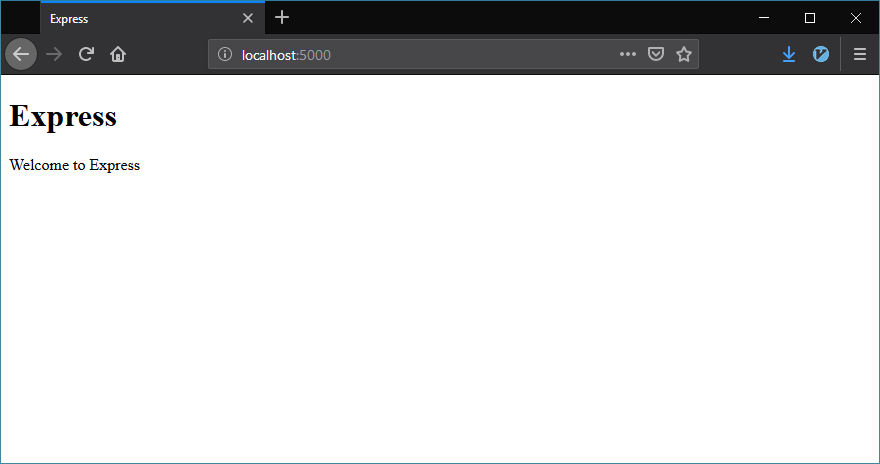
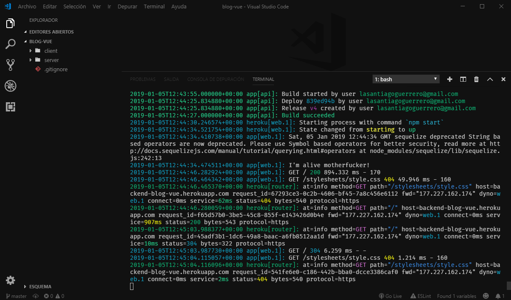
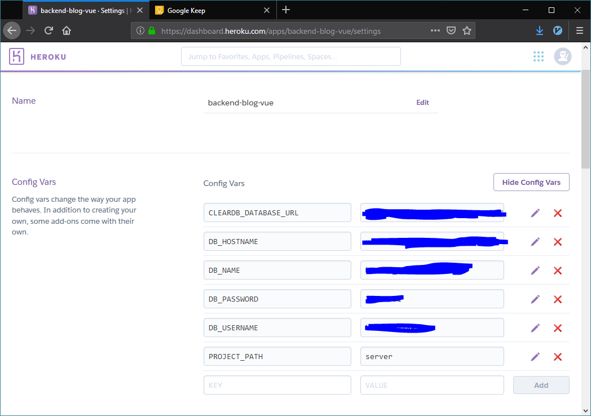
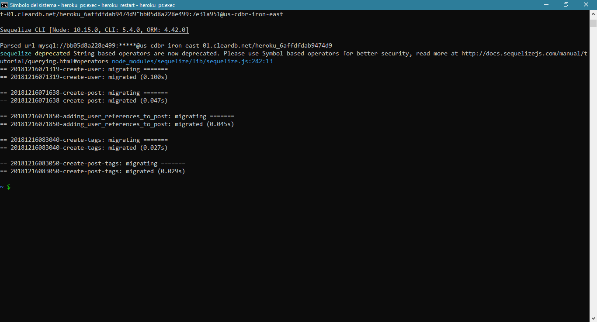
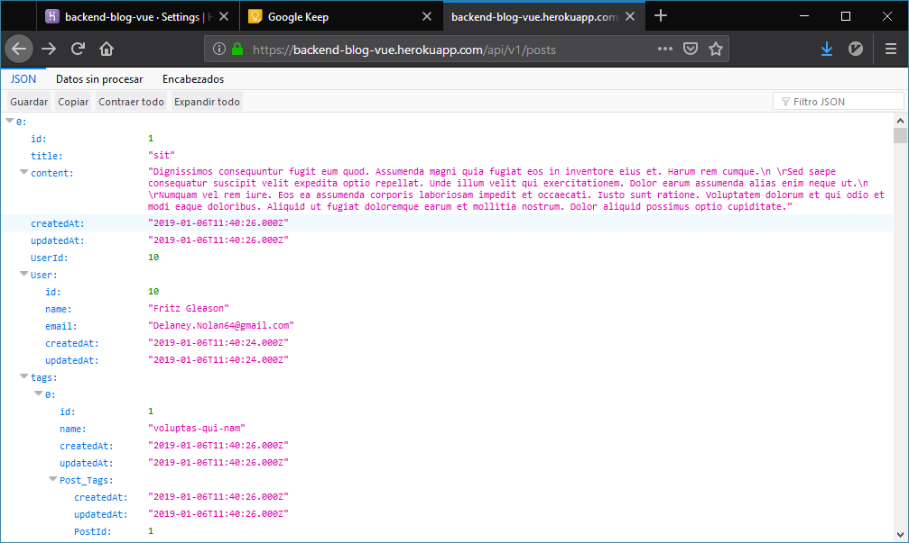

# Despliegue de aplicación backend Node.js en Heroku

Una rápida consulta en internet para saber qué es Heroku muestra lo siguiente: "Heroku es una plataforma como servicio de computación en la Nube que soporta distintos lenguajes de programación".

Básicamente Heroku es una plataforma para integrar diferentes aplicaciones.

Y aunque Heroku tiene una excelente documentación para desplegar las aplicaciones, la estructura de mi proyecto es un tanto diferente, mi proyecto inicialmente es un repositorio con dos subcarpetas, una para el lado del cliente y otra para el lado del servidor.

El tener las subcarpetas se me complicó un poco para desplegar la aplicación, ya que Heroku requiere que el proyecto esté en la carpeta raíz, pero una investigación me llevó a situaciones donde más personas habían tenido el mismo problema ya que algunos trabajan con los llamados "micro servicios" y tienen diferentes aplicaciones en un mismo repositorio.

Entonces la solución para desplegar mi aplicación fue aplicar los siguientes comandos, los cuales consisten en agregar algunos "buildpacks" y establecer una subcarpeta como directorio raíz para Heroku.

Enlace: [Artículo](https://medium.com/@timanovsky/heroku-buildpack-to-support-deployment-from-subdirectory-e743c2c838dd)

## Preparación para despliegue

Los comandos que ingreso son los siguientes: 

Comando: `heroku create` para crear el repositorio en la plataforma de heroku.

Comando: `heroku apps:rename backend-blog-vue` simplemente para cambiar el nombre por defecto que da Heroku al momento de crear la aplicación.

Comando: `heroku buildpacks:set https://github.com/timanovsky/subdir-heroku-buildpack` el comando que me permite desplegar la aplicación desde un subdirectorio.

Comando: `heroku buildpacks:add heroku/nodejs` comando para agregar el buildpack correspondiente para usar Node.js.

Comando: `heroku config:set PROJECT_PATH=server` comando para establecer en heroku como directorio raíz el directorio `server`.

### Desplegar en master

Una vez hecho lo anterior, se procede a ingresar el comando: `git push heroku master` y lo que hará será enviar el repositorio actual, con la rama actual al repositorio de heroku a la rama principal `master`.

### Escalar la aplicación

Cuando termina lo siguiente es escalar la aplicación usando el siguiente comando: `heroku ps:scale web=1`

### Probar la aplicación en local

Este paso se puede hacer en cualquier momento, hasta antes de hacer un `git push heroku master`, lo cual sirve para ver cómo se va a ejecutar la aplicación e producción.

Comando: `heroku local web`

Entonces se podrá mostrar la aplicación si se ingresa desde la ruta: `localhost:5000`.

> Es importante recalcar que existe un problema con el archivo Procfile, el cual es el encargado de leer el archivo de inicio para levantar la aplicación, se deben de hacer modificaciones cuando se quiera correr en local y cuando se deba de correr en producción.

> Procfile en local: `web node app.js`

> Procfile en producción: `web:node app.js`

La aplicación funciona, entonces se puede abrir desde la consola ingresando el comando: `heroku open`.

### Mostrando los logs

Una vez que la aplicación está arriba es buena opción mirar los logs para saber qué es lo que está pasando.

Usando el comando: `heroku logs --tail`

## Conectar MySQL a Heroku

Hasta este punto la aplicación no tiene conexión con MySQL, entonces hay que usar un recurso que presta Heroku el cual se llama "ClearDB MySQL".

Simplemente se agrega y listo, ya se tiene MySQL, sólo falta agregar las migraciones para crear las tablas e importar los datos desde MySQL Workbench.

### Variables de entorno para conexión a base de datos de producción

Para la conexión a la base de datos, cambié la configuración de Sequelize para que pueda leer variables de entorno, ya que anteriormente sólo se leían desde un archivo `json`.

Entonces con esa configuración se pueden crear las variables de entorno desde Heroku.

### Ejecutando migraciones

Para ejecutar las migraciones se debe de correr el comando: `sequelize db:migrate --url mysql:url`

Cambiando la Url donde se encuentra la conexión a la base de datos de MySQL, esto se debe de hacer desde la consola, conectado al servidor de Heroku.

##### Conectar a la consola de Heroku

Para conectar a la consola de Heroku desde la computadora local sólo se ingresa el comando: `heroku ps:exec` y ya se tiene una conexión.

#### Ejecutando migraciones

Una vez que se tiene la conexión se pueden ejecutar las migraciones.

Si se realiza una petición desde el navegador, se podrá ver que aún no hay datos en la base de datos, sólo está la estructura, para ello, es necesario conectarse mediante MySQL Workbench e importar los datos que una vez se exportaron desde una base de datos local.

#### Heroku mostrando datos

Al final es posible ingresar al sitio para poder ver los datos prueba que se han importado.

# Url de la aplicación

Url de la aplicación backend: [https://backend-blog-vue.herokuapp.com/](https://backend-blog-vue.herokuapp.com/)

